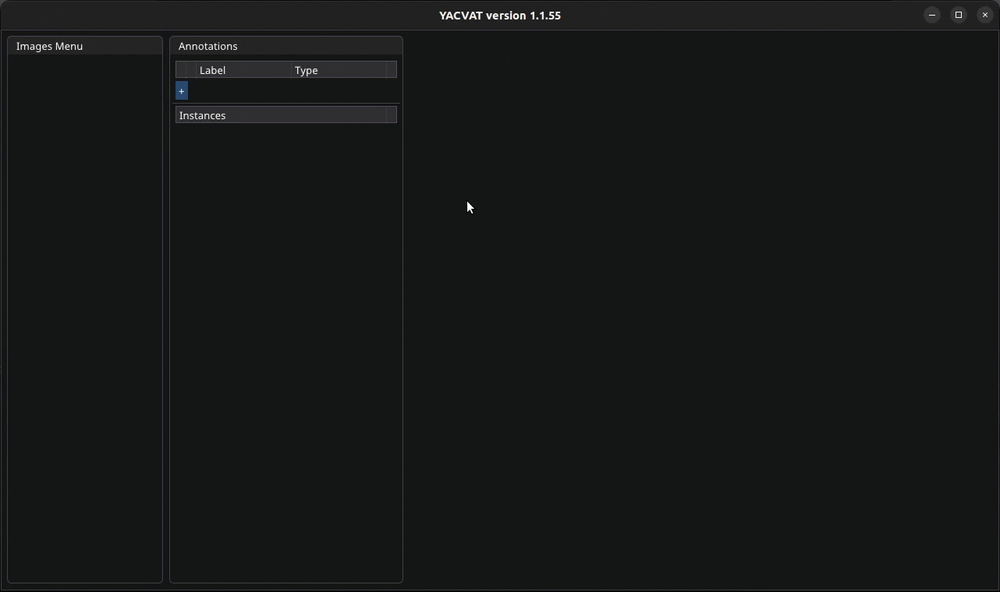

# YACVAT

YACVAT stands for Yet Another Computer Vision Annotation Tool.

## Things I wanted to try during this project

- Making a DearImGui app so I can compare the ease of use with DearPyGui
- Practicing some Cpp as I'm not that familiar with it
- Creating an annotation tool for computer vision
- Learning how to use various libraries in a project
- Using CMake (handling dependencies)
- Basic manipulation of images with OpenGL backend

## Libraries used in this project

I used code from other projects hosted on git. Run the `get_git_deps.sh` script to clone them in your current folder to be able to use them. Libraries used are as follows :

- [DearImGUI](https://github.com/ocornut/imgui.git)
- [Add-on to DearImGUI to be able to handle file dialogs](https://github.com/aiekick/ImGuiFileDialog)
- [Very complete logging library](https://github.com/gabime/spdlog)
- [Single file library to handle images](https://github.com/nothings/stb)
- [Json file handler](https://github.com/nlohmann/json.git)
- [Finite State Machine](https://github.com/eglimi/cppfsm.git)

## Features in current version 1.1

This is the first released version. It can be considered as alpha since it has to be built from source and has not yet been tested by others. It has the following features :

- [x] Define annotation types as areas or points, assign colors and labels
- [x] Import/export annotations using the json file format
- [x] Shortcuts : Use F-keys to quickly navigate and draw annotations
- [x] Edit annotations if needed after they're drawn by selecting them and moving them around

Tested on Linux only for now.

## Planned for version 1.2

- [ ] Annotation instance count displayed beside the image names;
- [ ] Embed font in application;
- [ ] Build also on Windows (use Boost to handle paths);
- [ ] Gather sources as a lib;
- [ ] Use github to host release artefacts;
- [ ] Package application as deb package;
- [ ] Make annotations resizable;
- [ ] Better slide when moving an annotation around (not jump to mouse cursor);
- [ ] Option to start next image with the same annotation instances than the current one.

## Notes

- GIF generated using `gifski --fps 10 --width 320 -o anim.gif video.mp4`
